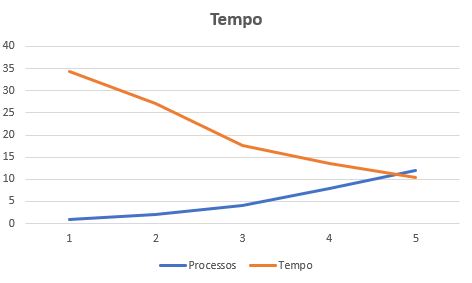
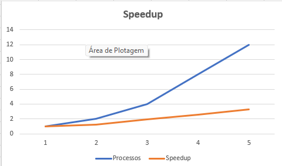
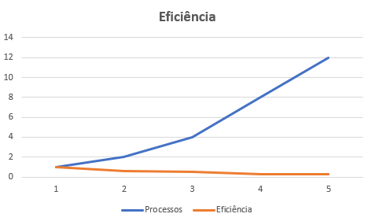

# Relatório da NOME DA ATIVIDADE

**Disciplina:PROGRAMAÇÃO CONCORRENTE E DISTRIBUÍDA** 
**Aluno(s):Max Muller Da Silva Rosa**
**Turma:S.I 4 semestre**
**Professor:Rafael**
**Data:10/04/2026**

---

# 1. Descrição do Problema

Descreva o problema computacional resolvido pelo programa.

## Orientações para preenchimento

Explique:

* Qual problema foi implementado
* Qual algoritmo foi utilizado
* Qual o tamanho da entrada utilizada nos testes
* Qual o objetivo da paralelização

**Questões que devem ser respondidas:**

* Qual é o objetivo do programa?
* Qual o volume de dados processado?
* Qual algoritmo foi utilizado?
* Qual a complexidade aproximada do algoritmo?

---

# 2. Ambiente Experimental

Descreva o ambiente em que os experimentos foram realizados.

## Orientações

Informar as características do hardware e software utilizados na execução dos testes.

| Item                        | Descrição |
| --------------------------- | --------- |
| Processador                 | Intel Core i5 (12ª geração) |
| Número de núcleos           | 12 (lógicos) |
| Memória RAM                 | 16 GB |
| Sistema Operacional         | Windows 11 |
| Linguagem utilizada         | Python |
| Biblioteca de paralelização | mpi4py (MPI) |
| Compilador / Versão         | Python 3.13 |

---

# 3. Metodologia de Testes

Explique como os experimentos foram conduzidos.

## Orientações

Descrever:

* Como o tempo de execução foi medido
* Quantas execuções foram realizadas
* Se foi utilizada média dos tempos
* Qual tamanho da entrada foi usado

### Configurações testadas

Os experimentos devem ser realizados nas seguintes configurações:

* 1 thread/processo (versão serial)
* 2 threads/processos
* 4 threads/processos
* 8 threads/processos
* 12 threads/processos

### Procedimento experimental

Descrever:

* Número de execuções para cada configuração
* Forma de cálculo da média
* Condições de execução (ex: máquina dedicada, carga do sistema, etc.)

---

# 4. Resultados Experimentais

Preencha a tabela com os **tempos médios de execução** obtidos.

## Orientações

* O tempo deve ser informado em **segundos**
* Utilizar a **média das execuções**

| Nº Threads/Processos | Tempo de Execução (s) |
| -------------------- | --------------------- |
| 1                    |          34.30        |
| 2                    |          27.03        |
| 4                    |          17.52        |
| 8                    |          13.46        |
| 12                   |          10.43        |

---

# 5. Cálculo de Speedup e Eficiência

## Fórmulas Utilizadas

### Speedup

```
Speedup(p) = T(1) / T(p)
```

Onde:

* **T(1)** = tempo da execução serial
* **T(p)** = tempo com p threads/processos

### Eficiência

```
Eficiência(p) = Speedup(p) / p
```

Onde:

* **p** = número de threads ou processos

---

# 6. Tabela de Resultados

Preencha a tabela abaixo utilizando os tempos medidos.

| Threads/Processos | Tempo (s) | Speedup | Eficiência |
| ----------------- | --------- | ------- | ---------- |
| 1                 |   34.30   | 1.0     | 1.0        |
| 2                 |   27.03   | 1.27    | 0.63       |
| 4                 |   17.52   | 1.96    | 0.49       |
| 8                 |   13.46   | 2.55    | 0.32       |
| 12                |   10.43   | 3.29    | 0.27      |

---

# 7. Gráfico de Tempo de Execução




---

# 8. Gráfico de Speedup




---

# 9. Gráfico de Eficiência




---

# 10. Análise dos Resultados

Realize uma análise crítica dos resultados obtidos.

## Questões a serem respondidas

* O speedup obtido foi próximo do ideal?
O speedup obtido não foi linear, ficando abaixo do ideal conforme o número de processos aumenta. Isso indica a presença de overhead de paralelização.

* A aplicação apresentou escalabilidade?
A aplicação apresentou escalabilidade limitada, com melhorias de desempenho ao aumentar o número de processos, porém com ganhos decrescentes.

* Em qual ponto a eficiência começou a cair?
A eficiência começou a cair significativamente a partir de 4 processos, indicando que o custo de gerenciamento e comunicação começou a impactar mais o desempenho.

* O número de threads ultrapassa o número de núcleos físicos da máquina?
O número de processos (12) corresponde aproximadamente ao número de núcleos lógicos da máquina, o que pode gerar competição por recursos.

* Houve overhead de paralelização?
Houve overhead de paralelização devido a:

Comunicação entre processos MPI
Sincronização
Parte do código que permanece serial (Lei de Amdahl)

Possíveis causas para perda de desempenho:

Sobrecarga de comunicação entre processos
Divisão de trabalho não totalmente balanceada
Limitações de memória e cache
Overhead do próprio MPI

Discutir possíveis causas para:

* perda de desempenho
* gargalos no algoritmo
* sincronização entre threads/processos
* comunicação entre processos
* contenção de memória ou cache

---

# 11. Conclusão

O uso de paralelismo trouxe ganho significativo de desempenho, reduzindo o tempo de execução de 34.30 segundos para 10.43 segundos com 12 processos.

O melhor tempo foi obtido com 12 processos, porém a melhor eficiência foi observada com menor número de processos.

O programa não escala de forma linear, apresentando limitações devido ao overhead de paralelização e restrições do hardware.

Melhorias possíveis incluem:

Otimização da divisão de tarefas
Redução de comunicação entre processos
Melhor balanceamento de carga
Uso de técnicas híbridas (MPI + threads)

---
